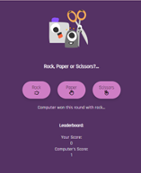
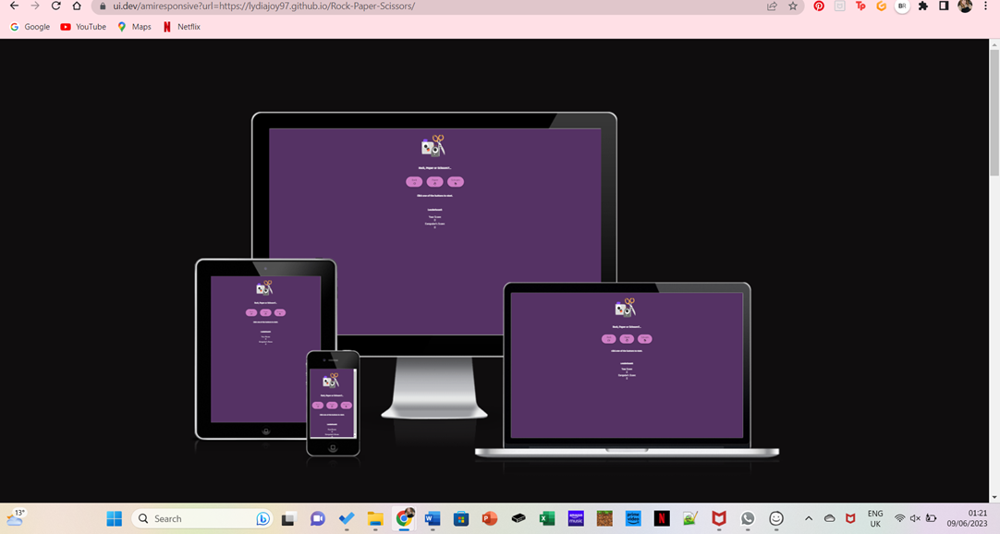
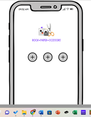
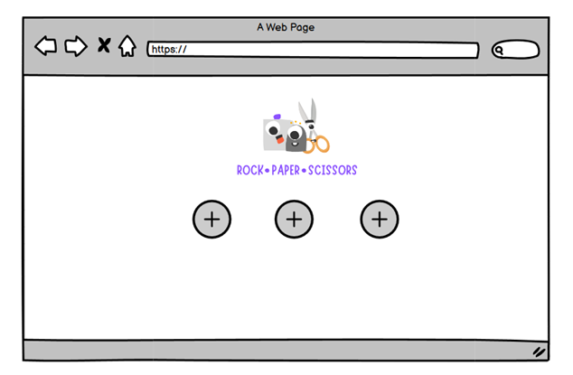
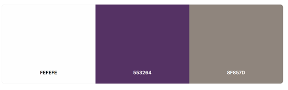
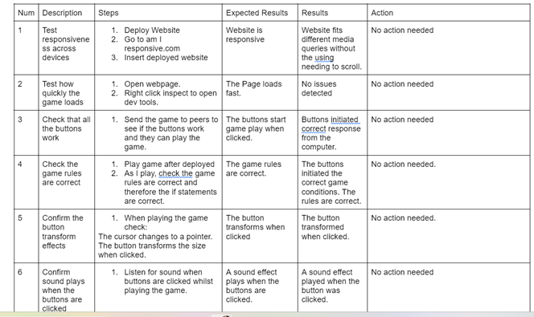
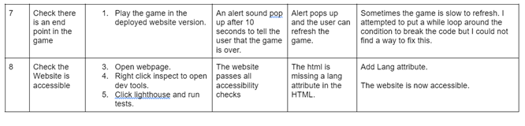

## Project Name : Rock, Paper, Scissors.

# **TABLE OF Contents**

* [**Project Brief**](#Project-Brief)

* [**User Experience** ](#User-experienceX)
* [**User Stories**](#User-Stories)
* [**Wireframes** ](#Wireframes)
* [**Surface-plan**](#Surface-plan)
* [**Features** ](#Features)
* [**Frameworks and libraries**](#Framewores-and-Liberies)
* [ **Testing**](#Testing)
* [ **Deployment**](#Deployment)
* [**Credits** ](#Credits)
* [**Acknowledgements** ](#Acknowledgements)

# Project-Brief 
Rock, Paper, scissors is a simple enjoyable game, but now that game can be played online! 
The website allows you to play, see scores and test your rock, paper, scissors ability against the computer!
The game is fun, fast and enoyable for all ages.

# User-Experience 
Project Outcomes:

To design a game that is fun and interactive.

To design a game that is easy to follow without much need for explaination or instructions. A game that anyone of all ablities can pick up and play.

To create a website that is a good experience for users with easy to read text and good accesibilty.

# User-Stories:
I would like a game that is fun and makes me want to play it again. 

I would like a website with a game thats easy to understand and without complicated instructions. A game that suits all ages and ablities.

I would like a game that is fast pace and accessible.

# Features 
1. Buttons for Rock, Paper and Scissors. 
2. A game logo. 
3. Rock, Paper and Scissors icons. 
This will help this know which button to click. This is helper if they have only been used to an in person version of this game.
4. A leaderboard display which updates in real time.
5. Sound effects on button clicks to add to user-experience along with button grow and shrink animation.
6. An alert for the user when the game ends to stop game play.

# Structure-Plan:
The web page will contain three buttons for Rock, Paper and Scissors in the centre. It will display a question 'Rock, Paper or Scissors?...' Which encourages the user to click a button and play the game. The results will be added up on the leaderboard and users can refresh the page to start again.
The page will have a cartoon logo which represents Rock, Paper and Scissors to add to the overall desgin look. 
The game will have sound effects on the buttons to make the page more fun and interactive. 

# Wireframes 

For the design plan, I decided to design for mobile first. This is because most of my users will play the game on a mobile. The game is small so it suits the mobile screen well. 
For the logo I created a design on canva. I wanted it to be fun and a bit different from the normal emoji-looking logo's that you might get for this particular game. 

# Design-and-Color-Scheme

I decided that I wanted purple to be the main color, and have white text so that there is a strong contrast from the dark background. 
The pink for the buttons was added later so that it was less plain. 

# Frameworks-and-Liberies 
1. HTML
2. CSS
3. JavaScript
4. Canva
5. Wireframes 
6. Google fonts 
7. Font awesome
8. https://mixkit.co/free-sound-effects/game/ 

# Testing-and-Results 
Strategy:
As this is a game built in Javascript, a lot of my testing comes from user interation. Therefore I sent it to my peers and friends to look at and give me feedback on. 
I then put a google document together of testing expetations and results. Then on that document if there was any action taken or bugs unfixed.
I then passed my code through the relevent validators and noted those results below.

Summary:
My Rock, Paper, Scissors game is fun and interative. The button animation and sound effects adds to the overall user experience. 
The game condition works and there weren't major issues found with the game. 

Testing Results:
I have created this document where my testing can be viewed. 

https://docs.google.com/document/d/1vNJprxrLzHRM5qVfZndlbw9qd5UBbFh8910uA_vErGU/edit?usp=sharing

# Validator-Results (HTML,CSS,Javascript)

Jigsaw Validator:
1. No errors found in W3C CSS Validator. 
HTML Validator:
2. A few stray tags were found and the lang attribute in the head tag were missing. These errors have been fixed and it now passes through the validator.
JShint Validator:
3. Semi Colans missing after passing through the JSHint Validator. It has now been fixed and has no errors. See below for metrics summary: 
CONFIGURE
Metrics
There are 8 functions in this file.

Function with the largest signature take 1 arguments, while the median is 0.5.

Largest function has 12 statements in it, while the median is 2.

The most complex function has a cyclomatic complexity value of 14 while the median is 1.

# Credits 
https://codepen.io/vikviki/details/YVygQB (For game conditions)

https://www.reddit.com/r/webdev/comments/13xfoud/monthly_getting_started_web_dev_career_thread

https://www.w3schools.com/graphics/game_score.asp  (For Math Floor Function)

https://www.youtube.com/watch?v=RwFeg0cEZvQ&t=826s (Ania Kubow tutorial)

https://betterprogramming.pub/7-ways-to-code-rock-paper-scissors-in-javascript-4189a5e7e535 (for conditions)

https://replit.com/talk/learn/Add-sound-to-a-button-in-Html-and-JavaScript/120876 (For sound button)

https://www.youtube.com/watch?v=F7iFnhSZe7o&t=167s (For button click animation)

https://www.w3schools.com/jsref/met_win_cleartimeout.asp (For timeOut function)

https://www.programiz.com/javascript/setTimeout (For timeOut function)

https://github.com/tindyc/Combat-Canvas (ReadMe structure)

Contents:
The contents of this webpage was written by me without any additional help.

# Deployment 
I used these commands in the terminal window:

git add . to add a new change to the main branch
git commit -m and a message explaining the updates to commit issues to the local repository.
git push was used to push all changes to the main branch.
git stash and git rest --hard to undo unsaved chaangeds.

# Run-Locally
1. Go to the GitHub repository. 2. Click on settings. 3. Under code and automation in the side menu, click pages. 4. Under the Build and Deployment section, Click to deploy from the main branch and save. 5. Your project is now live.

# Acknowledgements 
Thank you to my mentor Ronan for all his guidence and helpful resources.
Thank you too to my brother in law Callum Robley for all his help and guidence with Javascript and helping me write the inital structure. 
Thanks to my classmate Vas for his paitence and helping me tackle some JavaScript problems!